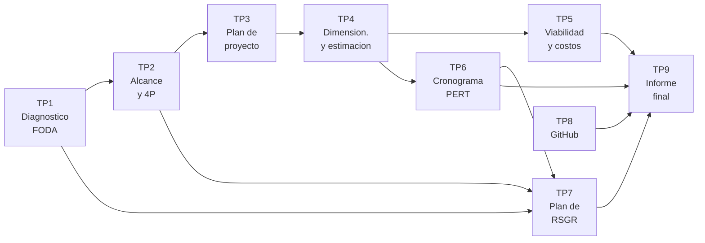

# Trabajos prácticos

Consignas de los trabajos prácticos de la materia.

Cada trabajo práctico se apoya en una unidad del [programa](../programa/) y produce un entregable que se incorpora al [proyecto integrador](../proyecto-integrador/).

Las fechas de entrega de cada ciclo lectivo están en la [planificación](../planificacion/).

---

## Índice

Los prácticos están numerados según el **orden de las unidades** que los habilitan. El orden en que se dictan en un ciclo determinado puede diferir: eso lo define la planificación anual.

| TP | Consigna | Unidad | Entregable |
|---|---|---|---|
| **TP1** | [Diagnóstico organizacional con matriz FODA](tp01-diagnostico-y-foda.md) | 4 | Informe de diagnóstico |
| **TP2** | [Documento de alcance y análisis con las 4P](tp02-alcance-y-4p.md) | 5 | Documento de alcance en dos versiones |
| **TP3** | [Plan de proyecto: descomposición, hitos y entregas](tp03-plan-de-proyecto.md) | 6 | Plan de proyecto |
| **TP4** | [Dimensionamiento y estimación: puntos función y COCOMO](tp04-dimensionamiento-y-estimacion.md) | 7 · 8 | Informe técnico de estimación |
| **TP5** | [Informe de viabilidad y costos](tp05-viabilidad-y-costos.md) | 9 | Informe de viabilidad + recomendación |
| **TP6** | [Cronograma: Gantt, PERT y camino crítico](tp06-cronograma.md) | 10 | Cronograma con camino crítico |
| **TP7** | [Plan de RSGR y matriz de riesgos](tp07-plan-de-rsgr.md) | 12 | Matriz de riesgos y fichas de RSGR |
| **TP8** | [Trabajo colaborativo con GitHub: web de una empresa](tp08-github-web-empresa.md) | 13 | Repositorio + informe de trabajo |
| **TP9** | [Informe técnico final del proyecto](tp09-informe-tecnico-final.md) | 17 | Informe final + defensa oral |

---

## Cómo se encadenan

Los prácticos no son independientes: cada uno usa el resultado del anterior.



Las dependencias más importantes:

| Práctico | Necesita de… |
|---|---|
| TP2 | La oportunidad de proyecto priorizada en el TP1 |
| TP3 | El alcance aprobado del TP2 |
| TP4 | La descomposición del TP3 |
| TP5 | El esfuerzo estimado del TP4 |
| TP6 | La descomposición del TP3 y la estimación del TP4 |
| TP7 | Las amenazas del FODA (TP1), los supuestos del alcance (TP2) y las dependencias externas del TP6 |
| TP9 | Todos los anteriores |

> Un práctico entregado sin haber hecho el anterior no se puede resolver bien. La secuencia no es una formalidad.

---

## Criterios generales de entrega

Salvo indicación en contrario, toda entrega debe cumplir:

- **Identificación.** Nombre del grupo e integrantes.
- **Reparto del trabajo.** Quién hizo cada parte. No alcanza con "lo hicimos entre todos".
- **Dificultades.** Qué problemas aparecieron y cómo se resolvieron.
- **Formato.** Documento legible y ordenado. Se prefiere formato de texto versionable en el repositorio del grupo.
- **Plazo.** Las entregas fuera de término se reciben con la calificación ajustada según el criterio informado al inicio del ciclo.

Se valora la claridad por encima de la extensión. Un documento de una página que define bien el alcance vale más que cinco páginas ambiguas.

---

## Sobre las rúbricas

Cada práctico incluye:

- **Criterios de evaluación** con el puntaje asignado a cada uno, sobre 100 puntos.
- **Lo que baja la nota**, con el descuento explícito.

Las dos tablas se publican por una razón: que el grupo pueda **autoevaluarse antes de entregar**. Los descuentos enumerados son los errores que efectivamente aparecen, no una lista teórica.

---

## Formato de entrega recomendado

Los prácticos que producen documentos conviene entregarlos en el repositorio del grupo, en Markdown, con la estructura:

```
proyecto-grupoX/
├── README.md                    ← qué es el proyecto y quiénes lo hacen
├── tp01-diagnostico.md
├── tp02-alcance.md
├── ...
└── anexos/
    ├── calculos-puntos-funcion.md
    └── planilla-estimado-real.md
```

Así el informe final del TP9 se arma integrando archivos que ya existen, en lugar de rehaciendo el trabajo, y todo el proyecto queda bajo gestión de configuración como pide la Unidad 13.
