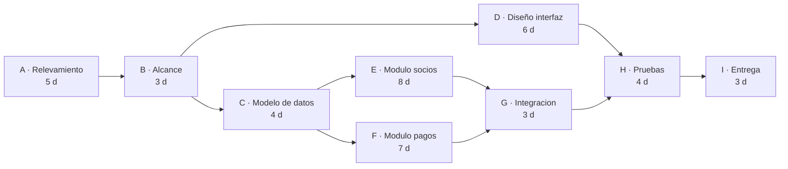
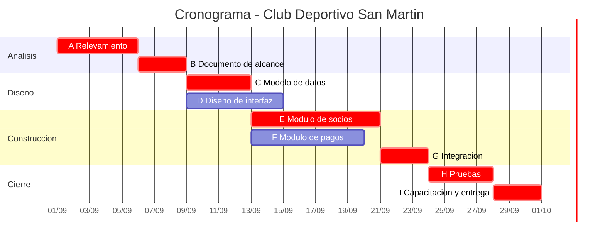

# Unidad 10
# Planificación temporal: Gantt y PERT

> "Un cronograma no dice cuándo va a terminar el proyecto. Dice qué tarea, si se atrasa un día, atrasa el proyecto un día."

---

# Objetivos de aprendizaje

Al finalizar esta unidad el estudiante será capaz de:

- Calendarizar un proyecto a partir de su estimación de esfuerzo.
- Distribuir el esfuerzo entre las etapas del ciclo de vida.
- Identificar dependencias entre tareas y construir una red de tareas.
- Construir un diagrama de Gantt.
- **Calcular el camino crítico y la holgura** mediante el método PERT.
- Realizar el seguimiento de la planificación comparando avance real contra previsto.

---

# De la estimación al cronograma

En la Unidad 8 estimamos que el proyecto del club requiere **32,6 persona-mes**.

Eso no es un cronograma. Un cronograma responde otras preguntas:

- ¿En qué orden se hacen las tareas?
- ¿Cuáles se pueden hacer al mismo tiempo?
- ¿Cuándo empieza y termina cada una?
- ¿Qué tarea no puede atrasarse sin atrasar todo?

## Esfuerzo no es duración

Es la confusión más frecuente de la planificación temporal.

**Esfuerzo** es cuánto trabajo hay: 32,6 persona-mes.
**Duración** es cuánto tiempo transcurre: 9,4 meses.

No son intercambiables. Un trabajo de 32 persona-mes no se hace en 1 mes con 32 personas.

| Personas | ¿Duración? | Realidad |
|---|---|---|
| 4 | 8 meses | Razonable |
| 8 | 4 meses | Optimista: hay más coordinación |
| 32 | 1 mes | Imposible |

Las razones son tres:

1. **Hay tareas secuenciales.** No se puede probar lo que no está construido.
2. **La coordinación crece.** Más gente implica más comunicación, que consume esfuerzo sin producir producto.
3. **La incorporación tiene costo.** Alguien nuevo tarda en ser productivo, y consume tiempo de quien ya estaba.

> Ninguna cantidad de gente reduce la duración por debajo de cierto mínimo. Ese mínimo lo determina el camino crítico.

---

# Distribución del esfuerzo

El esfuerzo no se reparte por igual entre las etapas.

Una distribución de referencia para un proyecto de software:

| Etapa | Porcentaje del esfuerzo |
|---|---|
| Análisis y definición de requerimientos | 15 – 20 % |
| Diseño | 15 – 20 % |
| Construcción | 30 – 40 % |
| Pruebas e integración | 20 – 30 % |
| Entrega y capacitación | 5 – 10 % |

Dos observaciones que cambian cómo se planifica:

- **La construcción es menos de la mitad del proyecto.** Un plan que le asigna el 80 % del tiempo está mal.
- **Las pruebas consumen tanto como el diseño.** Cuando el cronograma se atrasa, la etapa que se recorta es la de pruebas, y es la que produce el costo mayor a mediano plazo.

Aplicado al club: 32,6 persona-mes distribuidos dan aproximadamente 5,5 al análisis, 5,5 al diseño, 12 a la construcción, 8 a las pruebas y 1,6 a la entrega.

---

# Dependencias entre tareas

Una **dependencia** existe cuando una tarea no puede empezar hasta que otra haya terminado.

| Tipo | Descripción |
|---|---|
| **Obligatoria** | Impuesta por la naturaleza del trabajo: no se prueba lo que no existe |
| **De recurso** | La misma persona no puede hacer dos tareas a la vez |
| **Externa** | Depende de un tercero: una aprobación, una provisión, un dato |

Las obligatorias no se pueden eliminar. Las de recurso se resuelven con más gente. Las externas son las que más atrasos producen y las que menos se planifican.

## Tareas secuenciales y paralelas

| | Descripción |
|---|---|
| **Secuenciales** | Una después de la otra, por dependencia |
| **Paralelas** | Al mismo tiempo, sin dependencia entre ellas |

Identificar el paralelismo es lo que acorta la duración de un proyecto sin agregar esfuerzo. Es la ganancia más barata de la planificación.

---

# La red de tareas

Una **red de tareas** representa las tareas y sus dependencias.

## Caso: Club Deportivo San Martín

| Tarea | Descripción | Predecesoras | Duración |
|---|---|---|---|
| **A** | Relevamiento | — | 5 días |
| **B** | Documento de alcance | A | 3 días |
| **C** | Modelo de datos | B | 4 días |
| **D** | Diseño de interfaz | B | 6 días |
| **E** | Módulo de socios | C | 8 días |
| **F** | Módulo de pagos | C | 7 días |
| **G** | Integración | E, F | 3 días |
| **H** | Pruebas | D, G | 4 días |
| **I** | Capacitación y entrega | H | 3 días |

La suma de todas las duraciones es **43 días**. Pero como hay tareas paralelas, el proyecto dura menos. Cuánto menos es lo que calcula PERT.



---

# El método PERT

**PERT** (*Program Evaluation and Review Technique*) analiza la red de tareas para determinar la duración mínima del proyecto y qué tareas la condicionan.

## Los cuatro tiempos de cada tarea

| Sigla | Nombre | Significado |
|---|---|---|
| **ES** | Inicio temprano | Lo antes que puede empezar |
| **EF** | Fin temprano | Lo antes que puede terminar |
| **LS** | Inicio tardío | Lo más tarde que puede empezar sin atrasar el proyecto |
| **LF** | Fin tardío | Lo más tarde que puede terminar sin atrasar el proyecto |

## Recorrido hacia adelante

Se calculan ES y EF, desde el inicio hacia el final.

```
ES = el mayor EF de todas sus predecesoras   (0 si no tiene)
EF = ES + duración
```

Se toma el **mayor** porque la tarea no puede empezar hasta que hayan terminado *todas* sus predecesoras.

## Recorrido hacia atrás

Se calculan LF y LS, desde el final hacia el inicio.

```
LF = el menor LS de todas sus sucesoras   (duración del proyecto si no tiene)
LS = LF − duración
```

Se toma el **menor** porque la tarea debe terminar antes de que necesite empezar *la más urgente* de sus sucesoras.

## Holgura

```
Holgura = LS − ES
```

Es cuántos días puede atrasarse la tarea sin atrasar el proyecto.

## Camino crítico

El **camino crítico** es la secuencia de tareas con **holgura cero**.

Es el camino más largo de la red y determina la duración mínima del proyecto.

---

## Cálculo completo del caso

### Resultado

| Tarea | Pred. | Dur. | ES | EF | LS | LF | Holgura | Crítica |
|---|---|---|---|---|---|---|---|---|
| A | — | 5 | 0 | 5 | 0 | 5 | **0** | ✅ |
| B | A | 3 | 5 | 8 | 5 | 8 | **0** | ✅ |
| C | B | 4 | 8 | 12 | 8 | 12 | **0** | ✅ |
| D | B | 6 | 8 | 14 | 17 | 23 | 9 | |
| E | C | 8 | 12 | 20 | 12 | 20 | **0** | ✅ |
| F | C | 7 | 12 | 19 | 13 | 20 | 1 | |
| G | E, F | 3 | 20 | 23 | 20 | 23 | **0** | ✅ |
| H | D, G | 4 | 23 | 27 | 23 | 27 | **0** | ✅ |
| I | H | 3 | 27 | 30 | 27 | 30 | **0** | ✅ |

### Conclusiones

| | |
|---|---|
| **Duración del proyecto** | **30 días** |
| **Camino crítico** | A → B → C → E → G → H → I |
| Suma del camino crítico | 5 + 3 + 4 + 8 + 3 + 4 + 3 = 30 días |
| Suma de todas las tareas | 43 días |
| Ahorro por paralelismo | 13 días |

### Qué se lee de esta tabla

**La tarea D tiene 9 días de holgura.** El diseño de interfaz puede empezar hasta 9 días más tarde sin afectar la entrega. Es la tarea de la que se puede sacar gente si hace falta reforzar otra.

**La tarea F tiene 1 día de holgura.** Está casi crítica. Un atraso de dos días en el módulo de pagos convierte a F en crítica y atrasa el proyecto.

**Las siete tareas críticas no tienen margen.** Un día de atraso en cualquiera de ellas es un día de atraso en la entrega.

**Acelerar D no sirve de nada.** Reducir el diseño de interfaz de 6 a 3 días no adelanta la entrega ni un día, porque D no está en el camino crítico. Es el error más frecuente al intentar acelerar un proyecto: se optimiza lo que tiene holgura.

> Para acortar un proyecto hay que actuar sobre el camino crítico. Todo lo demás es esfuerzo sin efecto.

### Advertencia sobre el camino crítico

El camino crítico **cambia** durante el proyecto.

Si F se atrasa 2 días, el camino crítico pasa a incluir F. Si E se acelera 3 días, el camino crítico puede pasar por F.

Por eso el camino crítico se recalcula en cada corte de control, no se calcula una vez al inicio.

---

# El diagrama de Gantt

El **diagrama de Gantt** representa el cronograma como barras horizontales sobre una línea de tiempo.

Cada barra es una tarea; su largo, su duración; su posición, cuándo ocurre.

## Qué muestra bien

- Cuándo ocurre cada cosa.
- Qué tareas se solapan.
- Los hitos, como marcas puntuales.
- El estado de avance, si se sombrea la parte completada.

## Qué muestra mal

- **Las dependencias**, salvo que se dibujen flechas, y con muchas tareas el diagrama se vuelve ilegible.
- **La holgura**, que no es visible.
- **El camino crítico**, que hay que marcar aparte.

> Gantt y PERT no compiten: se complementan. PERT calcula, Gantt comunica. El análisis se hace con PERT y el resultado se presenta en Gantt.

## Gantt del caso



Las barras marcadas en rojo son las del camino crítico. Las tareas D y F, con holgura, se distinguen del resto.

> Este diagrama está escrito en **Mermaid**, que GitHub renderiza directamente. La ventaja es que el cronograma es texto: se versiona, se comparan cambios entre versiones y se corrige sin herramientas propietarias. Integra con la gestión de configuración de la Unidad 13.

---

# Seguimiento de la planificación

Un cronograma que no se controla es una expresión de deseos.

## Qué se compara

| Comparación | Qué revela |
|---|---|
| Avance real vs. avance previsto | Si el proyecto está en fecha |
| Esfuerzo consumido vs. estimado | Si la estimación era correcta |
| Tareas críticas terminadas vs. previstas | Si el atraso es grave o absorbible |

La tercera es la más importante y la que casi nadie mira. **Un atraso en una tarea con holgura no es lo mismo que un atraso en una tarea crítica**, y un informe de avance que no distingue entre ambos no informa nada.

## Ejemplo de corte de control

Día 15 del proyecto del club.

| Tarea | Previsto al día 15 | Real | Situación |
|---|---|---|---|
| A Relevamiento | Terminada | Terminada | Al día |
| B Alcance | Terminada | Terminada | Al día |
| C Modelo de datos | Terminada | Terminada | Al día |
| D Diseño interfaz | Terminada | 70 % | Atrasada, pero tiene 9 días de holgura |
| E Módulo socios | 37 % | 25 % | **Atrasada y es crítica** |
| F Módulo pagos | 43 % | 50 % | Adelantada |

**Lectura:** el atraso de D es irrelevante. El de E son 2 días sobre el camino crítico, es decir 2 días de atraso en la entrega.

**Decisión posible:** mover a alguien de D —que tiene holgura— a E. Es exactamente para eso que se calcula la holgura.

## Cuándo replanificar

No cada vez que algo se atrasa. Conviene replanificar cuando:

- el camino crítico cambió;
- el atraso acumulado en tareas críticas supera el margen del proyecto;
- se aprobó un cambio de alcance;
- una estimación demostró estar sistemáticamente equivocada.

---

# Errores frecuentes

- **Confundir esfuerzo con duración**, y suponer que más gente reduce el plazo proporcionalmente.
- **Planificar solo la construcción**, dejando análisis, pruebas y entrega sin tiempo asignado.
- **No identificar las dependencias externas**, que son las que más atrasan.
- **Acelerar tareas con holgura** creyendo que se adelanta la entrega.
- **Calcular el camino crítico una sola vez**, al inicio.
- **Informar avance sin distinguir** tareas críticas de tareas con holgura.
- **Recortar las pruebas** cuando el cronograma aprieta.
- **Hacer un Gantt sin haber hecho el análisis PERT**: queda un dibujo lindo sin fundamento.

---

# Buenas prácticas

✔ Derivar el cronograma de la estimación, no de la fecha deseada.

✔ Distribuir el esfuerzo entre todas las etapas, no solo la construcción.

✔ Identificar y registrar las dependencias externas.

✔ Buscar paralelismo: acorta el plazo sin sumar esfuerzo.

✔ Calcular la holgura de cada tarea y usarla para reasignar.

✔ Recalcular el camino crítico en cada corte de control.

✔ Informar el avance distinguiendo tareas críticas.

✔ Escribir el cronograma como texto versionable.

---

# Caso de estudio

## Acortar el proyecto

La comisión directiva del club pide que el proyecto termine en **25 días** en lugar de 30, para llegar al inicio de la temporada.

El equipo tiene disponibles: una persona más a tiempo parcial, y la posibilidad de tercerizar el diseño de interfaz.

### Para analizar

1. ¿Sobre qué tareas hay que actuar para reducir la duración? Justifique con la tabla de holguras.
2. Si se terceriza el diseño de interfaz (tarea D), ¿cuánto se adelanta la entrega? ¿Por qué?
3. Si se asigna la persona adicional al módulo de socios (E) y eso reduce su duración de 8 a 5 días, ¿cuál es la nueva duración del proyecto? Recalcule.
4. Después de ese cambio, ¿cuál es el nuevo camino crítico? ¿Cambió?
5. ¿Qué riesgo introduce reducir las pruebas (H) de 4 a 2 días?
6. Si ninguna alternativa alcanza los 25 días, ¿qué le propone a la comisión?

> Pista para el punto 3: al reducir E, la rama que pasa por F puede volverse determinante. Ahí está el aprendizaje de la actividad.

---

# Aplicación profesional

Cada grupo entrega el **cronograma de su proyecto**, que debe incluir:

- la tabla de tareas con predecesoras y duraciones, derivada de la estimación de la Unidad 8;
- la red de tareas;
- el cálculo completo de ES, EF, LS, LF y holgura para cada tarea;
- el camino crítico identificado y la duración del proyecto;
- el diagrama de Gantt, con el camino crítico distinguido;
- la lista de dependencias externas con el responsable de cada una.

Se valora especialmente que el cronograma esté escrito en formato versionable.

---

# Resumen

En esta unidad aprendimos que:

- Esfuerzo y duración no son intercambiables: más gente no reduce el plazo proporcionalmente.
- La construcción es menos de la mitad del esfuerzo de un proyecto.
- Las dependencias externas son las que más atrasos producen y las que menos se planifican.
- El paralelismo acorta el plazo sin agregar esfuerzo.
- PERT calcula ES y EF hacia adelante, LS y LF hacia atrás, y la holgura como LS − ES.
- El camino crítico es la secuencia de holgura cero y determina la duración mínima.
- Acelerar tareas con holgura no adelanta la entrega.
- El camino crítico cambia durante el proyecto y hay que recalcularlo.
- Gantt comunica, PERT calcula: se complementan.
- Un informe de avance que no distingue tareas críticas de tareas con holgura no informa nada.

---

# Actividad práctica

## Cronograma del proyecto

**1. Tabla de tareas**

A partir de la descomposición de la Unidad 8, armen la tabla con al menos doce tareas, sus predecesoras y sus duraciones.

**2. Red de tareas**

Dibujen la red. Se admite hecha a mano, en herramienta gráfica o en Mermaid.

**3. Cálculo PERT**

Calculen ES, EF, LS, LF y holgura para cada tarea. Muestren el recorrido hacia adelante y hacia atrás.

**4. Camino crítico**

Identifiquen el camino crítico y la duración del proyecto. Verifiquen que la suma del camino crítico coincida con la duración calculada.

**5. Gantt**

Construyan el diagrama de Gantt distinguiendo el camino crítico.

**6. Análisis**

Respondan: ¿qué tarea tiene más holgura y para qué la usarían? ¿Qué tarea está casi crítica? Si tuvieran que acortar el proyecto un 20 %, ¿sobre qué actuarían?

**7. Dependencias externas**

Listen las dependencias externas del proyecto, con responsable y fecha comprometida de cada una.

**Formato de entrega:** informe técnico con las tablas de cálculo y los diagramas.

---

# Preguntas de repaso

1. ¿Cuál es la diferencia entre esfuerzo y duración?

2. ¿Por qué duplicar la cantidad de personas no reduce la duración a la mitad?

3. ¿Qué porcentaje del esfuerzo corresponde aproximadamente a la construcción, y qué implica para la planificación?

4. Nombre los tres tipos de dependencia e indique cuál produce más atrasos.

5. Escriba las fórmulas de ES, EF, LS, LF y holgura.

6. ¿Por qué en el recorrido hacia adelante se toma el mayor EF y en el de atrás el menor LS?

7. ¿Qué es el camino crítico y qué determina?

8. ¿Por qué acelerar una tarea con holgura no adelanta la entrega?

9. ¿Por qué el camino crítico debe recalcularse durante el proyecto?

10. ¿Qué le falta a un informe de avance que no distingue tareas críticas de tareas con holgura?

---

# Bibliografía

- Pressman, R. *Ingeniería del Software: Un enfoque práctico.* Capítulo sobre planificación temporal y seguimiento del proyecto.
- Sommerville, I. *Ingeniería del Software.* Capítulo sobre planificación de proyectos.
- [Atlassian — Diagramas de Gantt](https://www.atlassian.com/es/agile/project-management/gantt-chart)
- [IBM — ¿Qué es un diagrama de Gantt?](https://www.ibm.com/think/topics/gantt-chart)
- [Mermaid — Sintaxis de diagramas de Gantt](https://mermaid.js.org/)
- Project Management Institute. [*Guía PMBOK*](https://www.pmi.org/standards/pmbok). Área de Gestión del Cronograma. _(acceso pago)_

---

**Fin de la Unidad 10**
