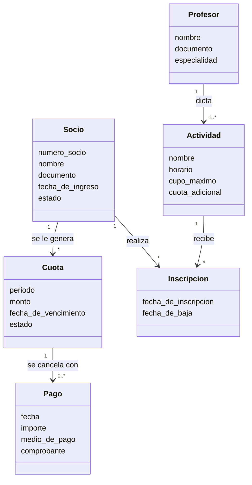

# Unidad 16
# Modelado del proyecto con UML

> "El diagrama no está para que el equipo entienda cómo va a programar. Está para que la organización pueda confirmar que entendimos su negocio."

---

# Objetivos de aprendizaje

Al finalizar esta unidad el estudiante será capaz de:

- Comprender para qué sirve UML en la comunicación con la organización.
- Leer e interpretar un diagrama de clases.
- Identificar las entidades del dominio a partir de lo relevado.
- Construir el modelo del dominio de su proyecto.
- Escribir diagramas como texto versionable.

---

> ## Sobre el alcance de esta unidad
>
> El diseño orientado a objetos —clases, herencia, polimorfismo, relaciones, diagramas de secuencia, patrones de diseño y refactoring— es contenido de **Algoritmos y Estructuras de Datos II**, que se cursa en paralelo este mismo año.
>
> Esta unidad **no enseña UML**: lo aplica. Su objeto es usar el modelado como instrumento del analista, para verificar y comunicar la comprensión del dominio relevado.
>
> Por eso ocupa una sola semana y trabaja exclusivamente sobre el diagrama de clases a nivel de dominio, sin entrar en decisiones de implementación.

---

# Para qué modela un analista

Un analista modela por una razón distinta a la de un programador.

| | El programador modela para… | El analista modela para… |
|---|---|---|
| **Propósito** | Decidir cómo construir | Verificar que entendió el problema |
| **Nivel** | Diseño, con detalles de implementación | Dominio, con los conceptos del negocio |
| **Destinatario** | El equipo técnico | La organización y el equipo |
| **Momento** | Antes de construir | Después de relevar |

## El modelo como instrumento de validación

Un diagrama de clases del dominio se puede poner sobre la mesa frente al referente de la organización y preguntar:

> "¿Es así como funciona el club?"

Y la organización puede responder que sí o que no.

Un documento de requerimientos de veinte páginas no admite esa pregunta. Un diagrama de doce cajas, sí.

**Ese es el valor del modelado para el analista:** hace visible y discutible lo que se entendió, en un formato que el cliente puede revisar.

## Lo que un modelo revela

Cuando se intenta modelar lo relevado, aparecen los huecos del relevamiento:

- conceptos que se nombraron pero nunca se definieron;
- relaciones que nadie aclaró: ¿un socio puede inscribirse en varias actividades?;
- reglas que se dan por obvias: ¿un pago corresponde a un solo período?;
- casos que nadie mencionó: ¿qué pasa con un socio que se va y vuelve?

> Modelar es la forma más eficiente de descubrir qué no se preguntó.

---

# Lectura de un diagrama de clases

Lo mínimo necesario para leer y construir un modelo de dominio.

## La clase

Se representa como un rectángulo con tres compartimentos: nombre, atributos y operaciones.

En un modelo de dominio suelen alcanzar los dos primeros: interesa **qué información** maneja el negocio, no qué métodos tendrá el objeto.

```
┌─────────────────────┐
│       Socio         │
├─────────────────────┤
│ numero_socio        │
│ nombre              │
│ documento           │
│ fecha_de_ingreso    │
│ estado              │
└─────────────────────┘
```

## Las relaciones

| Relación | Notación | Significado |
|---|---|---|
| **Asociación** | Línea simple | Dos conceptos se vinculan |
| **Agregación** | Rombo vacío | Una parte pertenece a un conjunto, pero puede existir sin él |
| **Composición** | Rombo lleno | La parte no existe sin el conjunto |
| **Herencia** | Triángulo hueco | Un concepto es un caso particular de otro |

## La multiplicidad

Es lo que más información aporta y lo que más se olvida.

| Notación | Significado |
|---|---|
| `1` | Exactamente uno |
| `0..1` | Ninguno o uno |
| `*` | Cualquier cantidad, incluso ninguna |
| `1..*` | Al menos uno |
| `2..4` | Entre dos y cuatro |

Cada multiplicidad es una **regla de negocio explícita**, y por eso es la parte del diagrama que hay que validar con la organización.

> "Un socio tiene muchos pagos, y cada pago pertenece a un solo socio" no es una decisión técnica: es una afirmación sobre cómo funciona el club, que el club tiene que confirmar.

---

# Del relevamiento al modelo

## Procedimiento

**1. Identificar candidatos a clase.** Recorrer lo relevado y anotar los sustantivos que designan cosas de las que el negocio guarda información.

**2. Descartar los que no son entidades.** Muchos sustantivos son atributos de otra cosa, no clases propias.

**3. Definir cada clase en una oración.** Si no se puede definir, el concepto no está claro.

**4. Identificar los atributos.** Qué información se guarda de cada entidad.

**5. Establecer las relaciones y su multiplicidad.**

**6. Validar con la organización.**

## Criterio para distinguir clase de atributo

| Pregunta | Si la respuesta es sí, es clase |
|---|---|
| ¿El negocio guarda varios datos de esto? | |
| ¿Existe de forma independiente? | |
| ¿Hay muchas instancias distinguibles? | |
| ¿Tiene un ciclo de vida propio? | |

*Ejemplos:*

| Concepto | ¿Clase o atributo? | Por qué |
|---|---|---|
| Socio | Clase | Tiene muchos datos, existe por sí mismo |
| Nombre del socio | Atributo | Es un dato de Socio |
| Actividad | Clase | Tiene nombre, horario, cupo, profesor |
| Estado del socio | Atributo | Es un dato, salvo que el negocio necesite historial de estados |

La última fila muestra que la decisión **depende del negocio**, no de una regla general. Si el club necesita saber cuándo un socio pasó de activo a moroso, el estado deja de ser un atributo y se convierte en una entidad con fecha.

Esa es exactamente la clase de pregunta que hay que llevarle a la organización.

---

# Modelo del dominio: Club Deportivo San Martín

## Clases identificadas

| Clase | Definición | Atributos principales |
|---|---|---|
| **Socio** | Persona asociada al club, con derecho a usar sus instalaciones | número, nombre, documento, fecha de ingreso, estado |
| **Cuota** | Obligación de pago correspondiente a un socio y un período | período, monto, fecha de vencimiento, estado |
| **Pago** | Registro de un importe recibido de un socio | fecha, importe, medio de pago, comprobante |
| **Actividad** | Disciplina deportiva que el club ofrece | nombre, horario, cupo máximo, cuota adicional |
| **Inscripción** | Vínculo de un socio con una actividad en un período | fecha de inscripción, fecha de baja |
| **Profesor** | Persona a cargo de una o más actividades | nombre, documento, especialidad |

## Diagrama



## Las decisiones del modelo y su fundamento

Cada decisión del diagrama es una afirmación sobre el negocio que hubo que confirmar.

| Decisión | Regla de negocio que expresa | Cómo se validó |
|---|---|---|
| `Cuota "1" --> "0..*" Pago` | Una cuota puede cancelarse con varios pagos parciales, y puede no tener ninguno si está impaga | Se preguntó si aceptan pagos parciales: sí |
| `Inscripcion` es clase y no relación simple | El club necesita saber cuándo un socio entró y salió de cada actividad | El profesor pidió el histórico de asistentes |
| `Pago` se asocia a `Cuota` y no a `Socio` | Todo pago se imputa a un período determinado | Se preguntó cómo imputan un pago sin período: no ocurre |
| `Profesor "1" --> "1..*" Actividad` | Cada actividad tiene un solo profesor a cargo, y todo profesor dicta al menos una | Confirmado con la administración |
| `estado` como atributo de `Socio` | Hoy alcanza con el estado actual | Se preguntó si necesitan el histórico: por ahora no |

> La última fila registra una decisión **y su fecha de validez**. Si mañana el club quiere el histórico de estados, el modelo cambia. Dejar registrado por qué se decidió así es lo que permite entender después por qué hay que cambiarlo.

## Las preguntas que el modelo hizo aparecer

Al construir este diagrama surgieron cuestiones que el relevamiento no había cubierto:

1. ¿Un socio puede inscribirse en dos actividades con el mismo horario?
2. ¿Qué ocurre con las cuotas de un socio que se da de baja y vuelve al año siguiente?
3. ¿Un pago puede cubrir cuotas de dos períodos distintos?
4. ¿El cupo de la actividad se controla al inscribir o solo se informa?
5. ¿Una actividad puede quedar sin profesor asignado temporalmente?

Ninguna era evidente antes de intentar modelar. Todas requieren respuesta de la organización antes de construir.

**Esto es el resultado más valioso de la unidad:** el modelo no es el entregable principal, la lista de preguntas lo es.

---

# Diagramas como texto versionable

El diagrama anterior está escrito en **Mermaid**: es texto, no una imagen.

## Por qué importa

| Diagrama como imagen | Diagrama como texto |
|---|---|
| No se puede comparar entre versiones | Se ve exactamente qué cambió |
| Requiere la herramienta que lo creó | Se edita con cualquier editor |
| Se desactualiza sin que se note | Cambia junto con el resto del proyecto |
| No entra bien en el control de versiones | Es un elemento de configuración como cualquier otro |

Esto conecta directamente con la Unidad 13: un diagrama en texto es un elemento de configuración que se versiona, se revisa en un pull request y se aprueba como parte de una línea base.

## Herramientas

| Herramienta | Característica |
|---|---|
| [Mermaid](https://mermaid.js.org/) | GitHub lo renderiza directamente en los archivos Markdown |
| [PlantUML](https://plantuml.com/es/) | Más completo en tipos de diagrama UML |

> El modelo de dominio de un proyecto debería poder mostrarse abriendo el repositorio, no buscando un archivo adjunto en un correo de hace cuatro meses.

---

# Errores frecuentes

- **Modelar la implementación en lugar del dominio**, y llevar a la organización un diagrama que no puede validar.
- **Omitir las multiplicidades**, que es donde están las reglas de negocio.
- **No validar el modelo** con la organización.
- **Convertir cada sustantivo en clase**, sin distinguir entidades de atributos.
- **No registrar el fundamento** de cada decisión del modelo.
- **No anotar las preguntas** que el modelado hizo aparecer.
- **Entregar el diagrama como imagen**, con lo que queda fuera del control de versiones.
- **Modelar antes de relevar**, con lo que el diagrama refleja lo que el equipo supone y no lo que la organización hace.

---

# Buenas prácticas

✔ Modelar el dominio, no la implementación.

✔ Definir cada clase en una oración antes de dibujarla.

✔ Explicitar todas las multiplicidades.

✔ Tratar cada multiplicidad como una regla de negocio a validar.

✔ Registrar el fundamento de cada decisión del modelo.

✔ Anotar las preguntas que el modelado hizo aparecer y llevarlas a la organización.

✔ Escribir el diagrama como texto versionable.

✔ Validar el modelo con el referente antes de considerarlo cerrado.

---

# Caso de estudio

## El modelo que nadie validó

Un equipo modeló el sistema de una veterinaria y construyó sobre ese modelo. En la entrega aparecieron tres problemas:

- El sistema no permite registrar una mascota con dos dueños, y en la veterinaria eso es habitual: parejas y familias que comparten un animal.
- Cada vacuna quedó como atributo de la mascota, con lo que solo se guarda la última aplicación. La veterinaria necesita el historial completo.
- Los turnos se asociaron a la mascota. Pero la veterinaria da turnos para varias mascotas del mismo dueño en una sola visita.

Del análisis posterior surgió que el modelo se construyó en dos horas a partir de las notas de la primera entrevista, nunca se mostró a la veterinaria, y las multiplicidades se completaron "con lo que parecía razonable".

### Para analizar

1. Para cada uno de los tres problemas, indique qué multiplicidad estaba mal y cuál debería ser.
2. ¿Cuál de los tres problemas es un error de clasificación clase/atributo? Explique.
3. Redacte las tres preguntas que, hechas a la veterinaria, habrían evitado los tres problemas.
4. Construya el modelo corregido, con sus multiplicidades.
5. ¿En qué momento del proyecto debería haberse validado el modelo?
6. ¿Qué relación tiene este caso con el riesgo de "no validar los supuestos" de la Unidad 12?
7. Estime el costo de corregir estos tres problemas después de la entrega, comparado con el de haber hecho tres preguntas en la semana 2.

---

# Aplicación profesional

Cada grupo entrega el **modelo de dominio** de su proyecto:

- listado de clases con su definición en una oración;
- atributos principales de cada clase;
- diagrama de clases con todas las multiplicidades explícitas, escrito en formato de texto versionable;
- tabla de decisiones del modelo, con la regla de negocio que cada una expresa y cómo se validó;
- **lista de preguntas** que el modelado hizo aparecer y que requieren respuesta de la organización;
- constancia de la validación con el referente.

La lista de preguntas se evalúa igual que el diagrama. Un modelo que no generó ninguna pregunta es, casi siempre, un modelo que se construyó sin mirar lo relevado.

---

# Resumen

En esta unidad aprendimos que:

- El analista modela para verificar que entendió el problema, no para decidir cómo construirlo.
- Un diagrama de doce cajas admite la pregunta "¿es así como funciona?"; un documento de veinte páginas, no.
- Modelar es la forma más eficiente de descubrir qué no se preguntó.
- Las multiplicidades son reglas de negocio explícitas y hay que validarlas con la organización.
- La distinción entre clase y atributo depende del negocio, no de una regla general.
- Registrar el fundamento de cada decisión del modelo es lo que permite entender después por qué hay que cambiarla.
- La lista de preguntas que el modelo hace aparecer es más valiosa que el diagrama mismo.
- Un diagrama escrito como texto es un elemento de configuración; como imagen, se desactualiza sin que se note.

---

# Actividad práctica

## Modelo de dominio del proyecto

**1. Candidatos**

Recorran su informe de relevamiento y listen todos los sustantivos candidatos a clase.

**2. Depuración**

Apliquen las cuatro preguntas del criterio para separar clases de atributos. Justifiquen los tres casos que les resultaron dudosos.

**3. Definiciones**

Definan cada clase en una oración. Si alguna no se puede definir, anótenlo como pregunta para la organización.

**4. Diagrama**

Construyan el diagrama de clases en Mermaid o PlantUML, con todas las multiplicidades explícitas.

**5. Tabla de decisiones**

Para cada relación, indiquen qué regla de negocio expresa y si está validada, supuesta o pendiente.

**6. Preguntas**

Listen todas las preguntas que el modelado hizo aparecer. Mínimo cinco.

**7. Validación**

Presenten el modelo al referente de la organización y registren qué corrigió. Entreguen ambas versiones: la previa y la validada.

**Formato de entrega:** informe técnico con el diagrama en texto, más la lista de preguntas como documento separado.

---

# Preguntas de repaso

1. ¿Para qué modela un analista, y en qué se diferencia del propósito del programador?

2. ¿Por qué un diagrama admite una validación que un documento extenso no admite?

3. ¿Por qué modelar hace aparecer huecos del relevamiento?

4. ¿Qué información aporta la multiplicidad y por qué es la parte que hay que validar?

5. Enuncie las cuatro preguntas que distinguen una clase de un atributo.

6. Dé un ejemplo donde la decisión clase/atributo dependa del negocio.

7. ¿Por qué la lista de preguntas puede ser más valiosa que el diagrama?

8. ¿Qué ventajas tiene un diagrama escrito como texto sobre uno entregado como imagen?

---

# Bibliografía

- [OMG — Especificación oficial de UML](https://www.omg.org/spec/UML/)
- [UML Diagrams — Diagramas de clases](https://uml-diagrams.org/class-diagrams-overview.html)
- [Mermaid — Diagramas de clases](https://mermaid.js.org/)
- [PlantUML en español](https://plantuml.com/es/)
- Sommerville, I. *Ingeniería del Software.* Capítulo sobre modelado de sistemas.
- Material de **Algoritmos y Estructuras de Datos II** para el diseño orientado a objetos y los tipos de relación en detalle.

---

**Fin de la Unidad 16**
